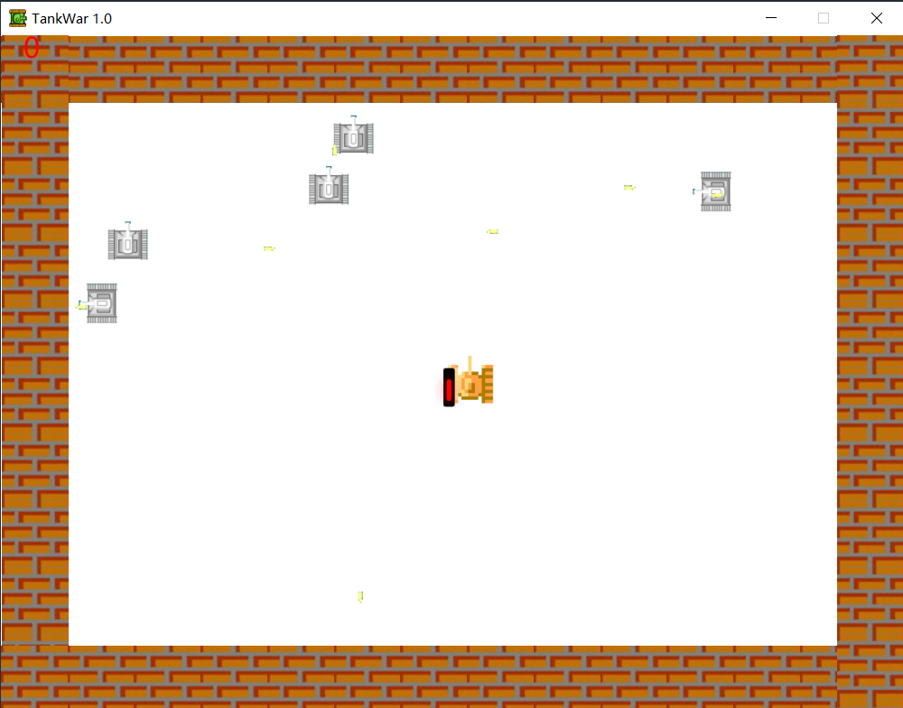
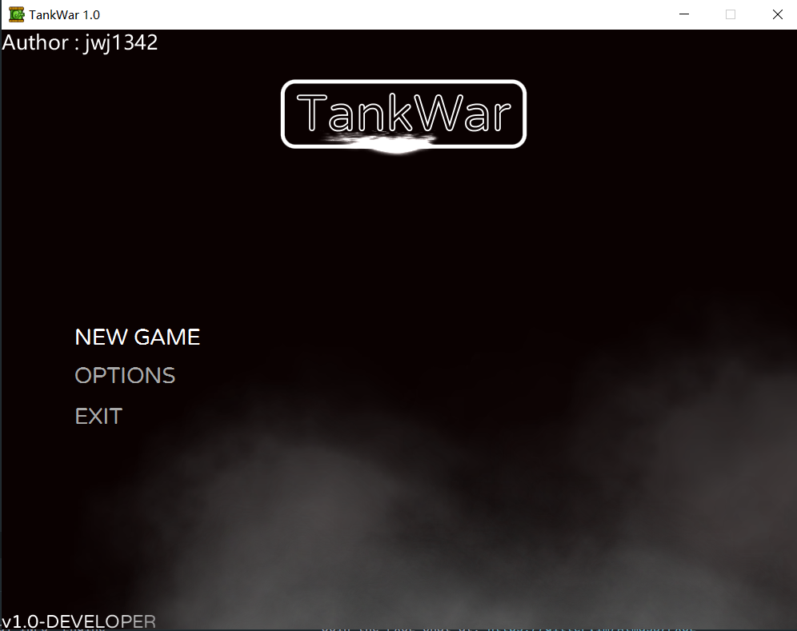
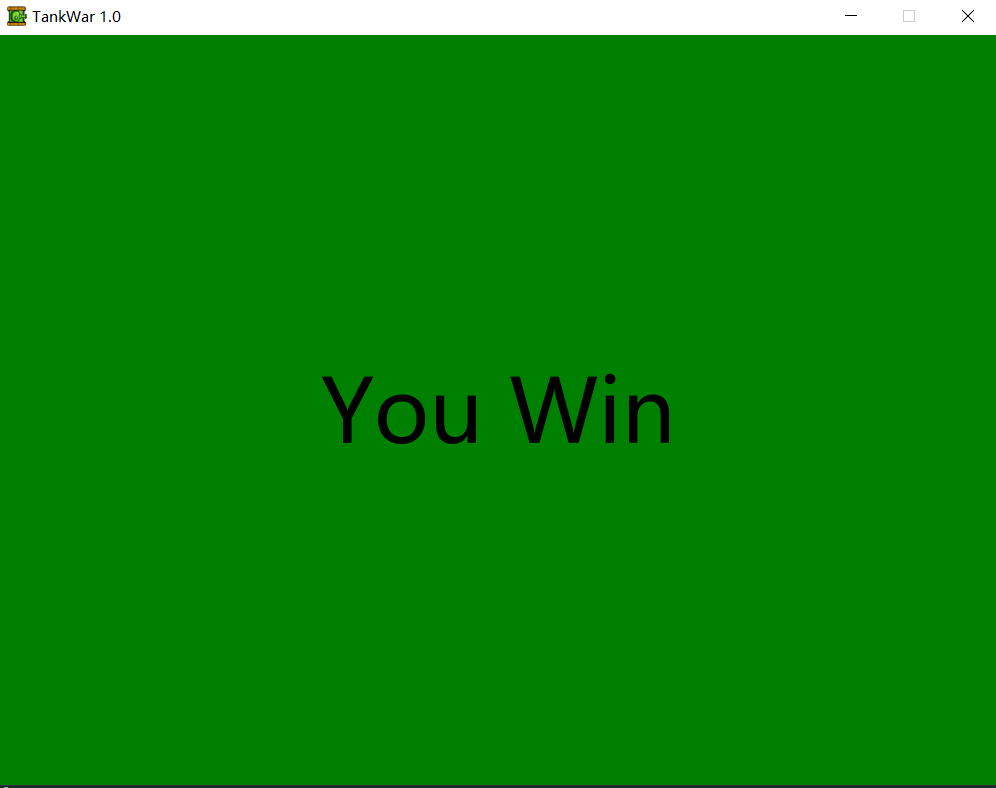

# TankWar

[toc]

## 引言

河南大学Java程序设计的期末大作业，要求设计一个坦克大战的游戏。老师所给的实例代码利用的是AWT进行设计的，但AWT技术能做的事情很少，当想要得到需要的效果时，不太适合用来设计游戏。于是我便采用Java比较流行的[FXGL](https://github.com/AlmasB/FXGL)
，一个JavaFX 游戏开发框架。该框架极其适合游戏的开发，API便于使用，文档介绍详细，很适合新手游戏开发。

本项目使用了maven进行项目依赖的管理, jdk版本为18，最后使用 `mvn clean javafx:jlink`,对整个程序进行打包。

## 游戏运行截图

## 关键技术小节

### ECS设计模式

- E : entity(实体)，
- C : component(组件)
- S : system (系统)

简言之，实例就是一个游戏对象实体，一个实体拥有众多的组件，而游戏系统则负责依据组件对实例做出更新。

举个例子，如果对象A需要实现碰撞和渲染，那么我们就给它加一个碰撞组件和一个渲染组件；如果对象B只需要渲染不需要碰撞，那么我们就给它加一个渲染组件即可。而在游戏循环中，每一个系统都会遍历一次对象，当渲染系统发现对象持有一个渲染组件时，就会根据渲染组件的数据来执行相应的渲染过程。同样的碰撞系统也是如此。

> [Entity component system]https://en.wikipedia.org/wiki/Entity_component_system
>
> 在本次开发中认知有误，一直以为使用的是抽象工厂模式，经过资料查证是ECS设计模式

### 资源文件说明

assets文件夹下面的组件可以被FXGL直接识别，**src/main/resources**

| assets子目录 |      说明       |       例如       |
|:---------:|:-------------:|:--------------:|
|  sounds   |  射击爆炸等短时间音效   | boom_sound.wav |
|  texture  | 游戏中的各种贴纸，地图元素 |   boom.png等    |

### Jlink构建跨平台Java运行时

[1]: https://learn.microsoft.com/zh-cn/java/openjdk/java-jlink-runtimes    "使用 jlink 的 Java 运行时"

[2]: https://zhuanlan.zhihu.com/p/349727180    "发布你的 JAVA 程序——使用 JLINK"

## 开发难点小节

待完善，还未从实验报告迁移过来。

## 待完善功能

- [ ] 地图的绘制
- [ ] 游戏结束画面后回到主菜单
- [ ] 客制化游戏初始界面
- [ ] 添加更多游戏元素

